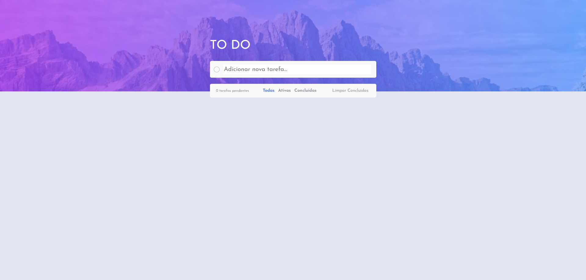
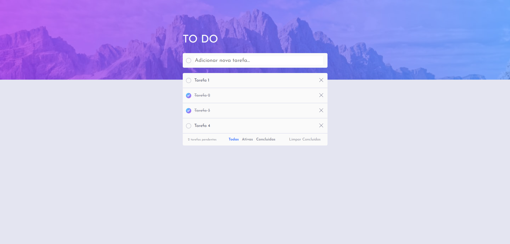

# to-do

Projeto criado para o desafio [Todo app](https://www.frontendmentor.io/challenges/todo-app-Su1_KokOW), com o objetivo de treinar HTML, CSS e JavaScript.

Você pode ver o resultado final [aqui](https://jessicalorenzon.github.io/to-do/).

